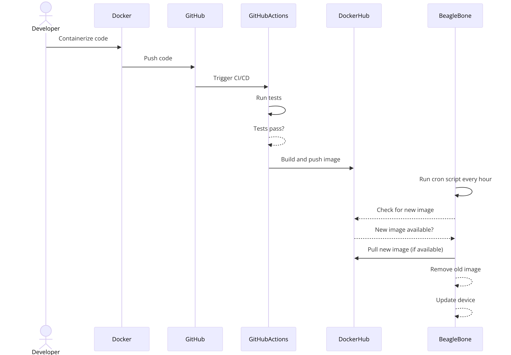

### Project structure

```scss
project-root/
├── .github/
│   └── workflows/
│       └── ci-cd.yml  # GitHub Actions workflow file
├── docs/
│   └── ... (Documentation files)
├── src/
│   ├── index.js
│   └── ... (other source files)
├── .dockerignore
├── .env.development
├── .env.production
├── Dockerfile
├── Dockerfile.dev
├── .gitignore
├── LICENSE
├── package.json
├── package-lock.json
├── README.md
├── VERSION
└── scripts/
    └── ... (shell scripts or other scripts for automation)

```

# Deployment Workflow for BeagleBone IoT Device



This document explains the workflow for deploying and updating an IoT application on a BeagleBone device.

## Overview

The workflow involves the following steps:

1. **Developer Containerizes Code**:

   - The developer starts by containerizing the application code using Docker.

2. **Push Code to GitHub**:

   - The containerized code is then pushed to a GitHub repository.

3. **Trigger CI/CD with GitHub Actions**:

   - Pushing the code triggers a CI/CD pipeline configured in GitHub Actions.

4. **Run Tests**:

   - The CI/CD pipeline runs tests on the application code.

5. **Tests Pass?**:

   - If the tests pass, the pipeline proceeds. If not, the process stops, and the developer needs to fix the issues and push the code again.

6. **Build and Push Image to DockerHub**:

   - Upon successful test completion, the pipeline builds a Docker image and pushes it to DockerHub.

7. **Run Cron Script on BeagleBone**:

   - The BeagleBone device has a cron script set up to run every hour.

8. **Check for New Image**:

   - The cron script checks DockerHub for a new image.

9. **New Image Available?**:

   - If a new image is available, the script proceeds to pull the new image.

10. **Pull New Image**:

    - The BeagleBone device pulls the new Docker image from DockerHub.

11. **Remove Old Image**:

    - The old Docker image is removed from the device.

12. **Update Device**:
    - The BeagleBone device is updated with the new Docker image, completing the deployment process.

This workflow ensures that your BeagleBone device always runs the latest version of the application with minimal manual intervention.
